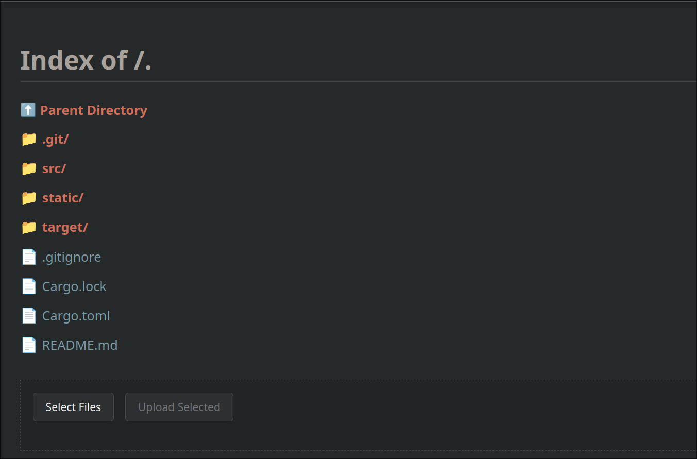
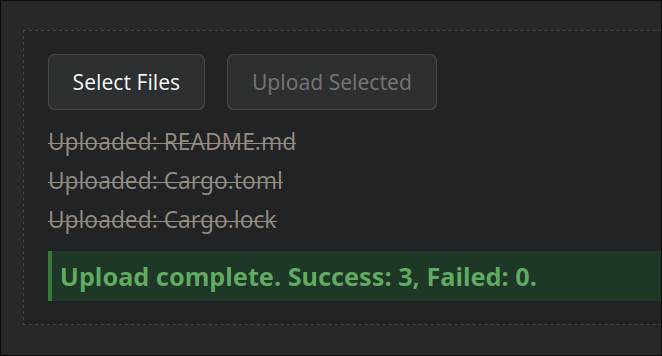

# HoloNet

**HoloNet** is a simple HTTP file upload server.

You can upload files using `curl`, optionally specifying a target filename and directory.  
It's designed to be lightweight, easy to run, and optionally supports TLS encryption.

---

## Screenshots

**Main Page:**



**Uploading File:**



---

## Installation

```bash
cargo install --git https://github.com/ShigShag/Holonet-HTTP-Server.git
```

## Running

```bash
./holonet
```

Or with TLS:

```bash
./holonet --tls --directory ./uploads
```

---

## Usage

### Upload a File

```bash
curl -X POST -T local_file http://127.0.0.1:7070/upload
```

### Optional: Custom Filename and Directory

```bash
curl -X POST -T local_file -H "X-Target-File: desired_filename.ext" -H "X-Target-dir: dirname" http://127.0.0.1:7070/upload
```

---

## Help Page

```text
A simple http server.

Upload a file:

curl -X POST -T file_path http://ip:port/upload

Optional / Custom file and directory name with:

curl -X POST -T file_path \
  -H "X-Target-File: desired_filename.ext" \
  -H "X-Target-dir: dirname" \
  http://ip:port/upload


Usage: holonet [OPTIONS]

Options:
  -d, --directory <DIRECTORY>  Root directory [default: .]
  -l, --host <HOST>            Host to bind the server to [default: 0.0.0.0]
  -p, --port <PORT>            Port to host the server on [default: 7070]
      --tls                    Use TLS encryption
  -h, --help                   Print help
  -V, --version                Print version
```
